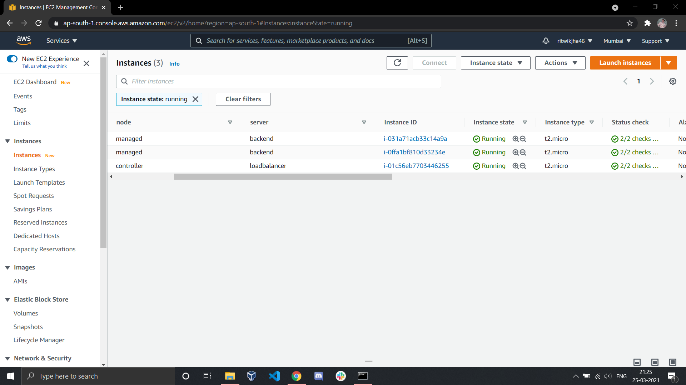
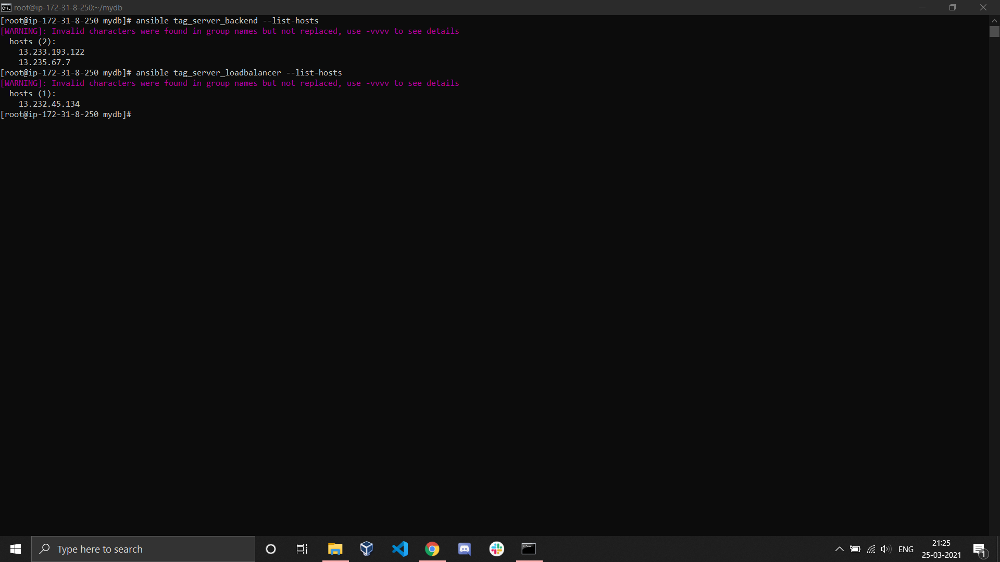
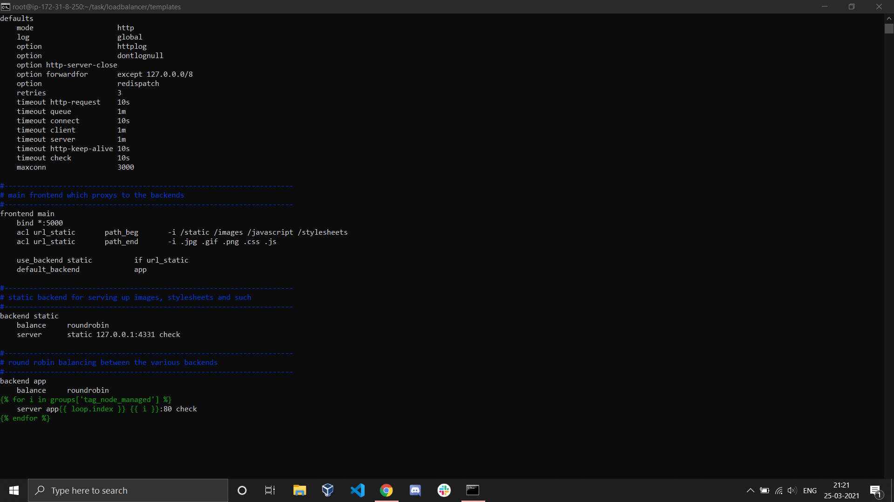
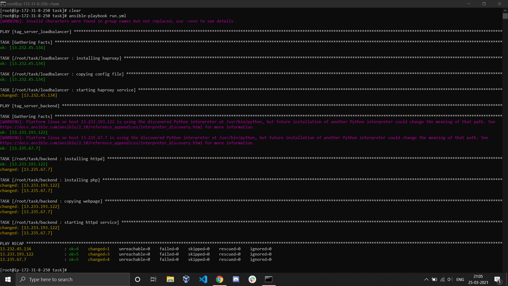
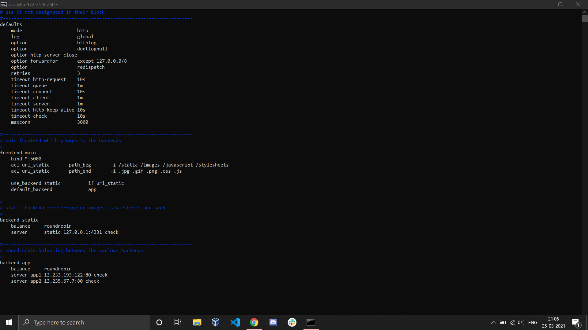
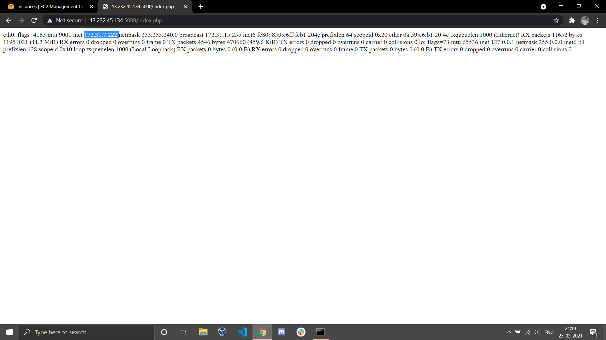
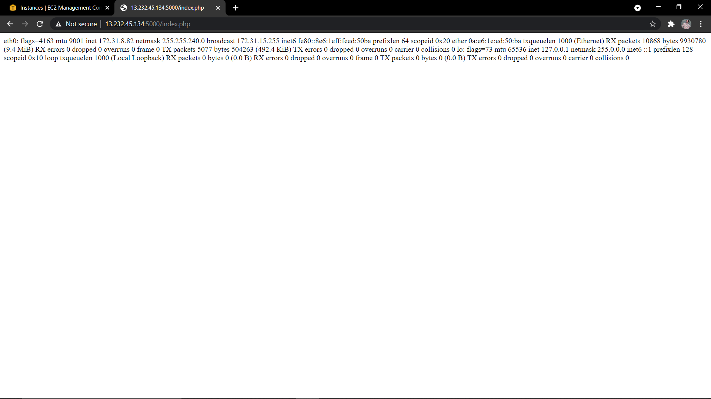

# Configuring Loadbalancer Backend-Server Architecture on EC2 Instances

## Description

In this project we set up a loadbalancer on ec2 instance and connect it with backend servers also running on ec2 instances and all of this will be done using ansible. We launch ec2 instances on aws cloud and we use ansible on our workstation to configure different instances with haproxy and httpd server. We use dynamic inventory to retrieve ip's of the instances from aws cloud. We group the retrieved ip's based on the assigned tags to the instances and then apply different roles for different groups. 

When we launch the ec2 instances we create a server tag and assign the values loadbalancer to the instance on which we want to configure haproxy and value backend to instances on which we configure httpd servers. 

## Steps

First we launch 3 instances with tag server with one having value loadbalancer and other two having value backend. We want to setup haproxy server on instance with tag loadbalancer and httpd server on instances with tag backend.

**Instances:**


For ansible to go to cloud and retrieve tag-wise instance ip's , boto and boto3 python module should be installed in the workstation.

To install boto and boto3

```bash
pip3 install boto boto3
```

To create a dynamic inventory we use ec2.py and ec2.ini file. These files can be donwloaded from github.

```bash
mkdir /mydb

cd /mydb

wget https://raw.githubusercontent.com/ansible/ansible/stable-2.9/contrib/inventory/ec2.py

wget https://raw.githubusercontent.com/ansible/ansible/stable-2.9/contrib/inventory/ec2.ini
```

This will dowload the ec2.py and ec2.ini file in the /mydb folder which we specify as the inventory in the ansible config file. 

**/mydb folder:**


We pass the aws access key id and aws secret access key to the ec2 ini file. This will help the script to login to our aws account and retrieve the desired contents. 
Both the files need to be placed in a separate folder and this folder is declared as the inventory in ansible config file. 

Now we can use ansile list host command to retrieve the ip's. 

To list hosts with tags server backend and loadbalancer

```bash
ansible tag_server_backend --list-hosts

ansible tag_server_loadbalancer  --list-hosts
```

**output:**


*This means that the dynamic inventory is working just fine.*

Now we move towards setting up the ansible config file so that ansible is able to contact the instances for configuration.
**Ansible uses ssh protocol to contanct the hosts.**
So we have to ensure that the instances are accessible on port number 22 and have ssh enabled. The connection over ssh needs user name and password but as we are using ec2 instances we need the private key for connection. We copy the private key in workstation and specify its location in the ansible.cfg file. 

Further ec2 instances doesn't allows ssh connection via root user so we have to use ec2-user to connect via ssh. But as ec2 user doesn't has enough powers we have to privilege escalation.

The private key in .pem format should be secured

```bash
chmod 600 private_key.pem
```

**/etc/ansible/ansible.cfg file:**


Now the connection part is done ie. ansible is able to connect to the hosts and can do any task.

The main aim of this project is that the loadbalancer automatically adds new instances that are launched with tag backend as backend servers. 
For this we use jinja templating in the haproxy.cfg file which will be copied in the loadbalancer instance. 

In the haproxy.cfg file we create a loop which will retrieve all the ip's in the tag_server_backend group and add as backend servers in the haproxy server running in the loadbalancer tag instance. 

**haproxy.cfg file:**


We create a webpage in php which will show the ip of instance when accessed via httpd server and then we copy this page to the /var/www/html folder of all the tag_server_backend instances. 


Now we create two roles. One for configuring haproxy loadbalancer and one for configuring backend httpd server. 
To create roles

```bash 

ansible-galaxy init loadbalancer

ansible-galaxy init backend

```

We copy the haproxy.cfg file in the template folder of loadbalancer role and index.php file in the template folder of backend role.

**loadbalancer/tasks/main.yml**


**backend/tasks/main.yml**


To run the roles we create an ansible playbook named run.yml .

**run.yml**


This playbook will run loadbalancer role in tag_server_loadbalancer host group and backend role in tag_server_backend host group where ip's in both groups are fetched dynamically.

To run this playbook:

```bash
ansible-playbook  run.yml
```

**output of playbook**


**The haproxy.cfg file copied to the loadbalancer instance**


*This clearly shows that the jinja templating is working fine and the haproxy has both the instances in tag_server_backend host group dynamically configured as backend servers of the loadbalancer*

Now time to test the configuration. If we try to access the loadbalancer ip at port 5000 it should redirect us to the index.php page that we pasted in the backend instances which will show us the private ip of the instance. 





*Thus everything is working fine and the webpage is showing us the ip's of the instances.*
